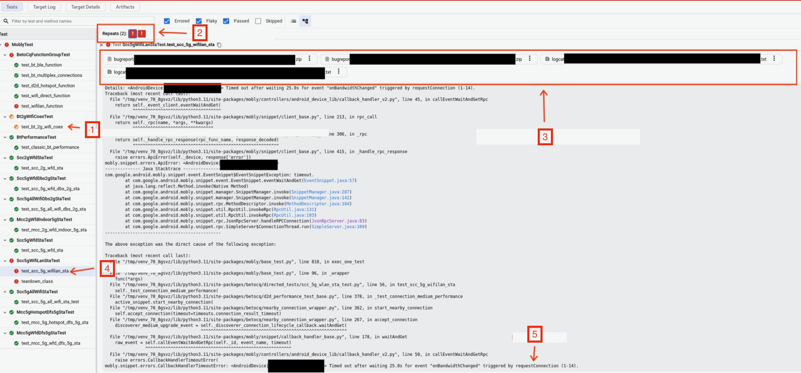
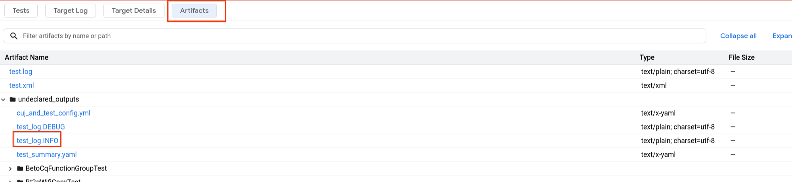
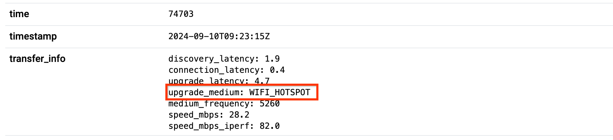
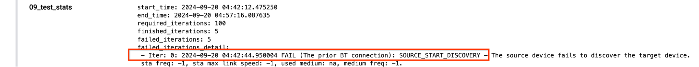
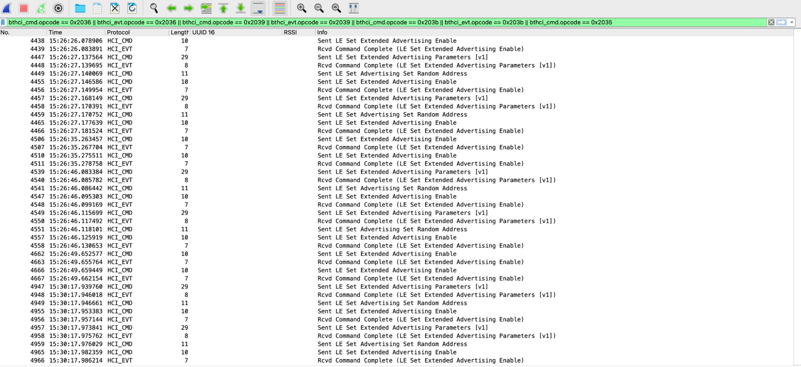
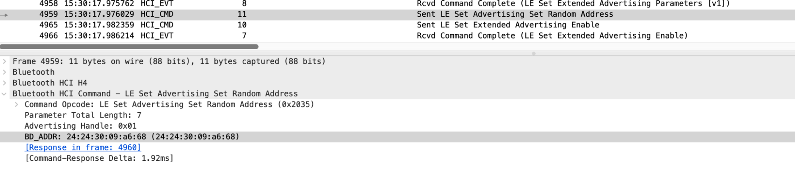
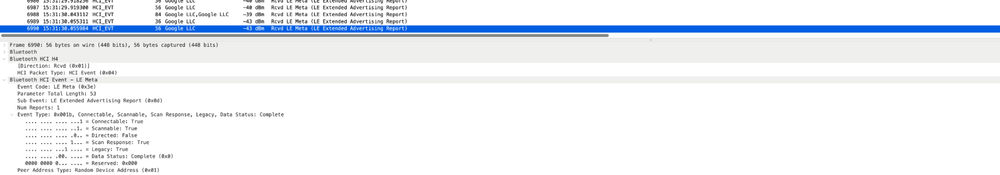

# BeToCQ test suite debugging playbook

This page explains how to debug Better Together Connectivity Quality (BeToCQ) test suite errors.

The section [Python failure signatures](#python-failure-signatures) lists typical failure signatures and triaging tips. The remaining sections provide debugging guidelines and detailed information about failure logs.

## Python failure signatures

For users who have access to BTX Result Viewer, find the Python failure signature by following these steps:

1.  Review test results in BTX Result Viewer.
1.  Find the name of failed test cases, as shown in Figure 1.

    

    **Figure 1.** BTX Result Viewer.

    <table>
    <tr>
    <th>Callout</th>
    <th>Description</th>
    </tr>
    <tr>
    <td>1</td>
    <td>This test case was flaky, but the flakiness rate was within the acceptable range.</td>
    </tr>
    <tr>
    <td>2</td>
    <td>Iteration 0 and 1 failed.</td>
    </tr>
    <tr>
    <td>3</td>
    <td>Artifacts for this test iteration, for example, bugreport and logcat</td>
    </tr>
    <tr>
    <td>4</td>
    <td>Red test case means all iterations failed. Red teardown_class means the flakiness rate was not in an acceptable range.</td>
    </tr>
    <tr>
    <td>5</td>
    <td>Failure signature</td>
    </tr>
    </table>

1.  Find the failed test iteration and these related logs, which you will use
in the debugging process:

    -   Failure signature, bugreport, and logcat
    -   `test_log.INFO`, which is available on the **Artifacts** tab:

        

        **Figure 2.** Artifacts tab.

### Wi-Fi STA connection failure

**Failure signature:**

```none
Failed to connect to '{"SSID":"OpenWRT-2G-BDjqr","password":"RandomPSK-M9RfS"}', timeout! Current connection: '<unknown ssid>'
```

**What happened:** The Android device failed to connect to the Wi-Fi AP.

**Triage tips:**

-   Verify that the Wi-Fi SSID and password are correct.
-   Try to remove any saved Wi-Fi networks from Wi-Fi settings before running the test.
-   Check if other devices can connect to the same AP.
-   Follow the instructions in [Get Wi-Fi received signal strength indicator (RSSI) on devices](#get-wi-fi-received-signal-strength-indicator-rssi-on-devices) to see if the RSSI is too high. If the RSSI is too high, try to move the device away from the AP. Usually an RSSI that is larger than -15&nbsp;dBm causes issues.
-   Follow the instructions in [Wi-Fi service logs](#wi-fi-related-logs) to check the Wi-Fi service logs on the device for any failure.

### Bluetooth discovery failure

**Failure signature:**

```none
Timed out after waiting 30.0s for event "onEndpointFound" triggered by startDiscovery
```

**What happened:** The source device failed to discover the target device
through Bluetooth.

**Triage tips:** Follow the instructions in [Bluetooth discovery timeout](#bluetooth-discovery-timeout-debugging) to check related debugging logs.

### Bluetooth connection failure

**Failure signature:**

```none
java.util.concurrent.ExecutionException: com.google.android.gms.common.api.ApiException: 8007: STATUS_RADIO_ERROR
at com.google.android.nearby.mobly.snippet.connection.ConnectionsClientSnippet.requestConnection(
```

**What happened:** This usually means there are errors from the Bluetooth
medium layer that cause the source device to fail to connect to the
target device.

**Triage tips:** Follow the instructions in [Bluetooth connection failure](#bluetooth-connection-failure-debugging) to get debugging logs and provide the logs to the your Bluetooth team to troubleshoot.

### Wi-Fi medium upgrade failure

**Failure signature:**

```none
Timed out after waiting 25.0s for event "onBandwidthChanged" triggered by requestConnection
```

**What happened:** Nearby Connection first established an initial connection and
then tried to upgrade the medium to Wi-Fi. An error happened in the upgrade
process.

**Triage tips:**

1.  Check the medium under test in the Mobly report:

    

    **Figure 3.** Mobly report.

    Refer to [Test cases definition](../README.md#test-cases-definition) for the list of test cases and corresponding mediums.

1.  See [Medium upgrade failure](#medium-upgrade-failure-debugging), which provides logs related to medium upgrade on various mediums. You can refer to them and check your device logs to identify the upgrade failure reason.

### Payload transfer failure

**Failure signature:**

```none
Timed out after 110.0s waiting for an "onPayloadTransferUpdate" event
```

**What happened:** After the connection was successfully established, the test
began to transfer files between the phones, but the transfer timed out. The
timeout typically means the Wi-Fi speed is is too low (for example, below 1~2&nbsp;MB) and Bluetooth speed is below
20&nbsp;kB/s.

**Triage tips:**

-   Check the medium under test in the Mobly report:

    

    **Figure 4.** Mobly report.

    Refer to [Test cases definition](../README.md#test-cases-definition) for the list of test cases and corresponding mediums.

-   See [Payload transfer failure](#payload-transfer-failure) for information about payload transfer logs.

### GMS update caused failure

**Failure signature:**

-   `test_log.INFO` contains this message:

    ```none
    No response from server. Check the device logcat for crashes
    ```

-   Logcat logs contain this log:

    ```none
    stop com.google.android.gms due to installPackage
    ```

**What happened:** Normally the GMS update is stopped by the test script during test
execution. But this failure signature means that the GMS update still happened
and caused the test failure.

**Triage tip:** Check the test initialization logs to see if there are any
errors related to the GMS update stop process. [Test stopped due to GMS update](#test-stopped-due-to-gms-update) provides an example where the GMS update is stopped successfully.

### Wrong P2P or STA frequency

**Failure signature:**

```none
P2P frequency (2432) is different from STA frequency (5180)
P2P frequency (5180) is same as STA frequency (5180) in MCC test case
```

**What happened:** The Nearby Connections connection was operating on an unexpected STA or P2P
frequency. Look in the logs to determine the specific reason.

**Triage tips:** Check the reported Wi-Fi Direct (WFD) frequency and STA frequency. For the single-channel concurrency (SCC)
test cases, the test suite reports errors if the P2P frequency doesn't equal the STA frequency.
For the multi-channel concurrency (MCC) test cases, the test suite report errors if the P2P frequency is equal to
the STA frequency.

-   For the SCC DBS test case, check if the device supports dual band simultaneous (DBS).
-   For the SCC indoor or DFS test case, check if the device supports indoor or DFS channels in WFD mode.
-   For an MCC test, check if the device support DBS, indoor or DFS features, then set device capabilities accordingly.
-   See example logs in [Wrong P2P or STA frequency](#wrong-p2p-or-sta-frequency).

### Transfer throughput is too low

**Failure signature:**

```none
file speed 28.263 < target 32.0 MB/s
```

**What happened:** The file transfer completed but the speed doesn't meet the speed target. The speed target is set based on the device capability.

**Triage tips:**

-   Check the device capability configured in `cuj_and_test_config.yml` to verify all fields are set accordingly.
-   See example logs in [Payload transfer succeeds but throughput is low (SccDfs5gWfdStaTest)](#payload-transfer-succeeds-but-throughput-is-low-sccdfs5gwfdstatest).

## Bluetooth discovery timeout debugging

This section explains how to extract and review Bluetooth logs to determine the root cause.

### Review bug report logs

Review the following bug report logs:

-   Mobly report:

    

    **Figure 5.** Mobly report test stats.

-   `test_log.INFO`:

    ```none
    09-20 04:42:49.304 INFO [AndroidDevice|33141FDJH0002A(Pixel 8)] Start advertising BLE_ONLY
    09-20 04:42:53.201 INFO [AndroidDevice|35081FDJG000FC(Pixel 8 Pro)] Start discovery BLE_ONLY
    09-20 04:43:23.409 ERROR Exception occurred in test_bt_2g_wifi_coex_0
    mobly.snippet.errors.CallbackHandlerTimeoutError: <AndroidDevice|35081FDJG000FC(Pixel 8 Pro)> Timed out after waiting 30.0s for the event "onEndpointFound" triggered by startDiscovery (1-2)
    ```

-   Target logs:

    ```none
    04:43:12.963	D	com.google.android.nearby.mobly.snippet.second.SnippetManager	286: Invoking RPC method class com.google.android.nearby.mobly.snippet.connection.ConnectionsClientSnippet#startAdvertising
    04:43:14.417	D	BtGatt.AdvertiseManager	startAdvertisingSet() - reg_id=-2, callback: android.os.BinderProxy@cb646b2
    ```

-   Source logs:

    ```none
    04:42:57.480	I	NearbyConnections	Client 251080613 requested discovery to start
    ```

### Extract the Bluetooth HCI log

-   Download and extract the bug report file.
-   Locate the HCI log file (device dependent) `xxx/FS/data/misc/bluetooth/logs/btsnooz_hci.log`.

### Review the HCI log

1.  Install and open [Wireshark](https://www.wireshark.org/).
1.  Open two Wireshark windows to view target and source logs at the same time.
1.  Open the target or advertiser device's `btsnooz_hci.log` file in Wireshark.
1.  Open the source or discoverer (also called scanner) device's `btsnooz_hci.log` file in Wireshark.
1.  Find the host timestamp of the test failure in the file `test_log.DEBUG`.

1.  Find the device timestamp of the test failure in logcat logs. For example, find the HCI timestamp in Wireshark with the following filters (device dependent):

    -   Target side:

        ```none
        bthci_cmd.opcode == 0x2036 || bthci_evt.opcode == 0x2036 || bthci_cmd.opcode ==
        0x2039 || bthci_evt.opcode == 0x2039 || bthci_cmd.opcode == 0x203b ||
        bthci_evt.opcode == 0x203b || bthci_cmd.opcode == 0x2035
        ```

    -   Source side:

        ```none
        bthci_evt.le_meta_subevent == 0x0d
        ```

        

        **Figure 6.** Wireshark HCI timestamp.

1.  Find the time delta between the HCI timestamp and the device log timestamp.

    -   From the two logs shown above, we know that there is a 30 minute time delta.
    -   We can also align them with the test sequence:
        -   The bug report was taken after the last test failure, when the discovery timeout happened.
        -   The last advertising in the HCI log should correspond to the target device advertising start time, which is the same as source discovery start time.

1.  Find the advertising BLE MAC address from the target or advertiser device's HCI log:

    -   Find the last **Sent LE Set Advertising Random Address** event.

        

        **Figure 7.** Advertising BLE MAC address.

    -   From the log shown above, we know that the advertising device's `BT_ADDR` is `24:24:30:09:a6:68`, which should persist for 5&nbsp;minutes or more depending on the [RPA timeout configuration](https://source.android.com/docs/core/connect/bluetooth/hci_requirements#le_set_rpa_timeout).

1.  See if there is a discovery event (`Rcvd LE Extended Advertising Report`) on the scanner with a matching `BT_ADDR`.

1.  Verify that the scanner advertising  event (`scan_response = false`) and response event (`scan_response = true`) are next to each other, as shown in this figure:

    

    **Figure 8.** Wireshark discovery log.

You can derive answers to these questions from the HCI logs:

-   Did advertising start properly?
-   Did scanning starter properly?
-   Did the scanner find the advertising packets?

### Review the Bluetooth framework log

Verify that the  Bluetooth scanner log looks like this:

```none
BtGatt.ScanHelper: onScanResult() - eventType=0x1b, addressType=1, address=53:00:5C:C3:89:1F, primaryPhy=1, secondaryPhy=0, advertisingSid=0xff, txPower=127, rssi=-42, periodicAdvInt=0x0, originalAddress=00:00:00:00:00:00
```

## Bluetooth connection failure debugging

This section explains how to debug Bluetooth connection failure.

### Source operation timeout

**Symptoms:**

Bluetooth connection failed due to socket operation timeout.

**Example logcat log:**

```none
06-05 20:35:07.600814  2954 27158 I bt_btif_sock: packages/modules/Bluetooth/system/btif/src/btif_sock.cc:161 btif_sock_connection_logger: address=00:00:00:00:00:00, role=1, state=1
06-05 20:35:07.600939  2954 27158 I bt_btif_sock_rfcomm: packages/modules/Bluetooth/system/btif/src/btif_sock_rfc.cc:320 btsock_rfc_listen: Adding listening socket service_name: NearbySharing - channel: -1
06-05 20:35:07.601281  2954  3245 I bt_bta_dm: packages/modules/Bluetooth/system/bta/dm/bta_dm_act.cc:3144 bta_dm_set_eir: Generating extended inquiry response packet EIR
06-05 20:35:07.602126  2954  3245 E bt_stack: [ERROR:port_api.cc(114)] RFCOMM_CreateConnectionWithSecurity: Invalid SCN, bd_addr=ff:ff:ff:ff:ff:ff, scn=31, is_server=1, mtu=990, uuid=000000
06-05 20:35:07.602216  2954  3245 E bt_stack: [ERROR:bta_jv_act.cc(1673)] bta_jv_rfcomm_start_server: RFCOMM_CreateConnection failed
06-05 20:35:07.602284  2954  3245 I bt_btif_sock: packages/modules/Bluetooth/system/btif/src/btif_sock.cc:161 btif_sock_connection_logger: address=00:00:00:00:00:00, role=5, state=1
06-05 20:35:07.602365  2954  3245 I bt_bta_dm: packages/modules/Bluetooth/system/bta/dm/bta_dm_act.cc:3144 bta_dm_set_eir: Generating extended inquiry response packet EIR
06-05 20:35:07.602518  2954  3857 E bt_btif_sock_rfcomm: packages/modules/Bluetooth/system/btif/src/btif_sock_rfc.cc:158 find_rfc_slot_by_id: find_rfc_slot_by_id unable to find RFCOMM slot id: 2054
{{ '<strong>' }}06-05 20:35:07.603872 16036  4776 E NearbyMediums: MEDIUM_ERROR [SYSTEM][BLUETOOTH][START_LISTENING_INCOMING_CONNECTION][ACCEPT_CONNECTION_FAILED][UNKNOWN], Service ID : NearbySharing [CONTEXT service_id=54 ]{{ '</strong>' }}
06-05 20:35:07.603924 16036  4776 E NearbyMediums: Extra Sensitive/PII message : read failed, socket might closed or timeout, read ret: -1 [CONTEXT service_id=54 ]
```

### STATUS_RADIO_ERROR

**Symptoms:**

`STATUS_RADIO_ERROR` (error code 8007) usually means there are some errors from the
Bluetooth medium layer. Your Bluetooth team needs to investigate.

**Example logcat log:**

```none
09-11 17:44:15.606040 10185 19195 24114 E NearbyMediums: Failed to create an outgoing MultiplexBleSocket because the MediumOperation registration failed, mac=XX:XX:XX:XX:F0:B8
09-11 17:44:15.606631 10185 19195 24114 E NearbyMediums: Failed to retrieve a physical BLE socket when creating a BLE socket, mac=XX:XX:XX:XX:F0:B8, service-id=pNNNgvL7, operation-detail=CONNECTIVITY_L2CAP_CLIENT_SOCKET_CREATION_TIMEOUT_FAILURE
09-11 17:44:15.630450 10185 19195 24114 W NearbyConnections: Failed to connect to endpoint NDZ6 over medium BLE_L2CAP [CONTEXT service_id=54 ]
09-11 17:44:15.630450 10185 19195 24114 W NearbyConnections: bxvc: In bleL2capConnectImpl(), failed to connect to BLE_L2CAP device BlePeripheral{advertisement=BleAdvertisement { version=2, socketVersion=2, isFast=false, serviceIdHash=[ 0xf1 0x81 0x90 ], data=[ 0x23 0xf1 0x81 0x90 0x4e 0x44 0x5a 0x36 0x0e 0x33 0x41 0x30 0x39 0x31 0x46 0x44 0x4a 0x47 0x30 0x30 0x32 0x56 0x57 0x00 0x00 0x00 0x00 0x00 0x00 0x00 0x00 ], deviceToken=[ 0x50 0xb5 ], rxAdvertisement=null }, address=null, psm=174, deviceToken=<ByteString@a14026 size=2 contents="P\\265">, isSecondProfile=false, rxInstantConnectionAdv=null} for endpoint NDZ6

09-11 17:44:15.633575 10185 19195 24114 I NearbyConnections: [PERFORMANCE] Connection latency 5596 ms, BLE_L2CAP, RESULT_ERROR

09-11 17:44:15.649063 10303 18743 18765 E com.google.android.nearby.mobly.snippet.RpcUtil:135: java.util.concurrent.ExecutionException: com.google.android.gms.common.api.ApiException: 8007: STATUS_RADIO_ERROR
09-11 17:44:15.649063 10303 18743 18765 E com.google.android.nearby.mobly.snippet.RpcUtil:135: Caused by: com.google.android.gms.common.api.ApiException: 8007: STATUS_RADIO_ERROR
```

## Medium upgrade failure debugging

This section describes how to debug medium upgrade failure.

### Wireless LAN medium

The Wireless LAN (WLAN) medium works in the following sequence:

1.  The target device advertises its IP address and other information over mDNS through the [`NsdManager`](https://developer.android.com/reference/android/net/nsd/NsdManager) API.
-   The source device discovers the target device and its IP address through the `NsdManager` API.
-   The source device creates a socket with the target device's IP address.
-   The source device enables TDLS and tries to call `socket.connect()`.

#### Successful WLAN medium upgrade example

Here's an example of target and source logs when Nearby Connection successfully upgraded to WLAN medium:

**Target logcat logs:**

```none
08-30 00:31:59.661 23850 23938 I NearbyConnections: [BandwidthUpgradeProtocol] Set upgrading medium WIFI_LAN for VDLA
08-30 00:31:59.811 23850 24385 I NearbyConnections: Computed the intersection of supported mediums with endpoint VDLA. Between their supported mediums ([WIFI_LAN]) and my supported mediums ([WIFI_LAN]) we decided on the combined subset ([WIFI_LAN]).
08-30 00:32:00.049 23850 23938 I NearbyMediums: Successfully started listening for incoming Wifi Lan connections.
08-30 00:32:00.201 23850 24481 I NearbyConnections: incoming WIFI_LAN upgrade latency 536 ms
08-30 00:32:00.201 23850 24481 I NearbyConnections: EndpointChannelManager encrypted channel of type WIFI_LAN to endpoint VDLA
08-30 00:32:00.201 23850 24481 I NearbyConnections: EndpointChannelManager replaced endpoint VDLA's channel from type ENCRYPTED_BLUETOOTH to type ENCRYPTED_WIFI_LAN.
08-30 00:32:00.303 23850 24475 I NearbyConnections: EndpointManager switched its Read loop from BLUETOOTH EndpointChannel to ENCRYPTED_WIFI_LAN EndpointChannel for endpoint VDLA.
```

**Source logcat logs:**

```none
08-30 00:32:00.104 26769 27337 I NearbyConnections: [BandwidthUpgradeProtocol] Set upgrading medium WIFI_LAN for BOSZ
08-30 00:32:00.146 26769 27337 I NearbyMediums: Bind Wifi LAN socket on network 2018.
08-30 00:32:00.171 26769 27337 I NearbyConnections: Get local endpoint id from the existing `localEndpointId` VDLA for com.google.android.nearby.mobly.snippet
08-30 00:32:00.171 26769 27337 I NearbyConnections: BandwidthUpgradeManager uses ConnectionEndpointId(VDLA) as local EndpointID
08-30 00:32:00.186 26769 27337 I NearbyConnections: outgoing WIFI_LAN upgrade latency 82 ms
```

#### Upgrade failure due to socket connection timeout

Here's an example where Nearby Connections failed to upgrade to WLAN medium. Your Wi-Fi team should
investigate.

**Source log:**

The source device failed to connect to the target device after 3 seconds. See the logcat logs:

```none
09-15 03:48:07.474 I NearbyConnections: [BandwidthUpgradeProtocol] Set upgrading medium WIFI_LAN for L1YB
09-15 03:48:07.496 I NearbyMediums: Bind Wifi LAN socket on network 478.
09-15 03:48:09.055 E NearbyMediums: MEDIUM_ERROR [SYSTEM][WIFI_LAN][CONNECT][ESTABLISH_CONNECTION_FAILED][NETWORK_ERROR_EHOSTUNREACH], service-id=kwfvsUkr
09-15 03:48:09.055 E NearbyMediums: Extra Sensitive/PII message : WifiSocketName : /192.168.0.51::50052, Exception : failed to connect to /192.168.0.51 (port 50052) from /192.168.0.18 (port 55908) after 3000ms: isConnected failed: EHOSTUNREACH (No route to host)
09-15 03:48:09.061 I NearbyMediums: Bind Wifi LAN socket on network 478.
09-15 03:48:11.361 E NearbyMediums: MEDIUM_ERROR [SYSTEM][WIFI_LAN][CONNECT][ESTABLISH_CONNECTION_FAILED][NETWORK_ERROR_EHOSTUNREACH], service-id=kwfvsUkr
09-15 03:48:11.361 E NearbyMediums: Extra Sensitive/PII message : WifiSocketName : /192.168.0.51::50052, Exception : failed to connect to /192.168.0.51 (port 50052) from /192.168.0.18 (port 55922) after 3000ms: isConnected failed: EHOSTUNREACH (No route to host)
09-15 03:48:11.367 I NearbyMediums: Bind Wifi LAN socket on network 478.
09-15 03:48:13.664 E NearbyMediums: MEDIUM_ERROR [SYSTEM][WIFI_LAN][CONNECT][ESTABLISH_CONNECTION_FAILED][NETWORK_ERROR_EHOSTUNREACH], service-id=kwfvsUkr
09-15 03:48:13.664 E NearbyMediums: Extra Sensitive/PII message : WifiSocketName : /192.168.0.51::50052, Exception : failed to connect to /192.168.0.51 (port 50052) from /192.168.0.18 (port 49450) after 3000ms: isConnected failed: EHOSTUNREACH (No route to host)
09-15 03:48:13.694 W NearbyMediums: Failed to create client Wifi socket because we failed to register the MediumOperation.
09-15 03:48:13.695 E NearbyConnections: BandwidthUpgradeManager failed to create an endpoint channel to endpoint L1YB on WIFI_LAN, aborting upgrade. [CONTEXT service_id=54 ]
09-15 03:48:13.695 E NearbyConnections: bxwq: WifiLanBandwidthUpgradeMedium failed to join available wifi LAN socket (/192.168.0.51, 50052) on endpoint L1YB, aborting upgrade.
09-15 03:48:13.698 I NearbyConnections: BandwidthUpgradeManager has informed endpoint L1YB that the bandwidth upgrade failed.
```

**Target log:**

```none
09-15 03:48:07.025 I NearbyConnections: Computed the intersection of supported mediums with endpoint 0NBC. Between their supported mediums ([WIFI_LAN]) and my supported mediums ([WIFI_LAN]) we decided on the combined subset ([WIFI_LAN]).
09-15 03:48:07.469 I NearbyMediums: Ping IP(/192.168.0.18) timeout, took 1024ms
09-15 03:48:07.495 I NearbyMediums: Successfully bound ServerSocket for service kwfvsUkr_UPGRADE to the stable port 50052.
09-15 03:48:07.495 I NearbyMediums: Successfully started listening for incoming Wifi Lan connections.
09-15 03:48:13.787 I NearbyConnections: BandwidthUpgradeManager process BANDWIDTH_UPGRADE_NEGOTIATION frame event type:UPGRADE_FAILURE
09-15 03:48:13.788 W NearbyConnections: BandwidthUpgradeManager remote endpoint 0NBC failed to upgrade
09-15 03:48:13.789 I NearbyMediums: Stopped listening for incoming Wifi Lan connections.
09-15 03:48:13.790 I NearbyConnections: [BandwidthUpgradeProtocol] Remove upgrading medium WIFI_LAN for 0NBC
```

Here are a few things to try during WLAN medium upgrade failure debugging:

-   Ensure the firewall is disabled in the test AP or the connected network.
-   Check if a ping from one device to the other device is successful. Try ping tests at least 10 times with 10 or more seconds of idle time between tests.
-   Check if the device has aggressive power saving. Check if the failure is gone after turning off power saving.

#### Upgrade failure due to AP being blocked

Here's an example where Nearby Connections failed to upgrade to WLAN medium because the current
Wi-Fi BSSID is in a denylist.

You can fix this problem by rebooting the device. In BeToCQ 2.3.4 or higher
versions, this problem shouldn't happen because the denylist is cleared by the flag override.

**Logcat logs on either source device or target device:**

```none
09-15 03:48:16.830 I NearbyMediums: BSSID 70:a7:41:c6:f1:2c has failed in the past, ignored this time.
09-15 03:48:16.830 W NearbyMediums: MEDIUM_ERROR [DEVICE][WIFI_LAN][CONNECT][MEDIUM_NOT_AVAILABLE][IN_BLACK_LIST], service-id=kwfvsUkr
```

### WFD medium

Here's an example of a successful medium upgrade to WFD.

**Target logcat logs:**

```none
07-12 16:37:02.058539  3874 17219 I NearbyConnections: [BandwidthUpgradeProtocol-OptimizedUpgradeMediumRanking] Initial [BandwidthUpgradeState] 6GHz Mediums: [], 5GHz Mediums: [WIFI_DIRECT, WIFI_LAN, WIFI_HOTSPOT], 2.4GHz Mediums: [WIFI_LAN, WIFI_DIRECT, WIFI_HOTSPOT], [Initial Bandwidth: BANDWIDTH_5_GHZ][Current Bandwidth: BANDWIDTH_5_GHZ][Index: 0] for 89UH, [CONTEXT service_id=54 ]
07-12 16:37:02.059458  3874 17219 I NearbyConnections: [BandwidthUpgradeProtocol] Set upgrading medium WIFI_DIRECT for 89UH [CONTEXT service_id=54 ]
07-12 16:37:02.430936  3874 17219 I NearbyMediums: Use P2pGroup to create a WiFi Direct group [CONTEXT service_id=54 ]
07-12 16:37:02.439739  3874 17213 I NearbyConnections: ClientProxy(119544042) reporting onPayloadTransferUpdate(89UH, -9088688058850507777, SUCCESS) [CONTEXT service_id=54 ]
07-12 16:37:02.492474  3874 17219 I NearbyMediums: Optimize Wi-Fi available/usable frequencies, Local available frequencies: [5180, 5200, 5240, 5805, 5220, 5765, 5745, 5785, 2462, 2427, 2412, 2452, 2422, 2447, 2417, 2457, 2437, 2442, 2432]. Remote available frequencies: [5825, 5180, 5220, 5765, 5200, 5785, 5805, 5240, 5745, 2437, 2412, 2447, 2472, 2457, 2452, 2442, 2467, 2462, 2432, 2422, 2417, 2427]. Intersection available frequencies: [5180, 5200, 5240, 5805, 5220, 5765, 5745, 5785, 2462, 2427, 2412, 2452, 2422, 2447, 2417, 2457, 2437, 2442, 2432] [CONTEXT service_id=54 ]
07-12 16:37:02.492766  3874 17219 I NearbyMediums: Optimize Wi-Fi available/usable frequencies, localApFrequency : 5805, remoteApFrequency : 5805, use5Ghz : true, use6Ghz : false, specifiedBandwidth : BANDWIDTH_5_GHZ [CONTEXT service_id=54 ]
07-12 16:37:02.494822  3874 17219 I NearbyMediums: Optimize Wi-Fi available/usable frequencies result : [5805, 5200, 5240, 5180, 5220, 5765, 5785, 5745] [CONTEXT service_id=54 ]
07-12 16:37:02.674980  1664  3086 D WifiP2pService: FAST_CONNECTION GO band freq: 5805
07-12 16:37:02.495002  3874 17219 I NearbyMediums: Prepare hosting WiFi Direct group with specified bandwidth BANDWIDTH_5_GHZ. Shared available channels: [5805, 5200, 5240, 5180, 5220, 5765, 5785,
07-12 16:37:03.046177  3874 17219 I NearbyMediums: Successfully hosted WiFi Direct group for service -5223680986655924951 [CONTEXT service_id=54 ]
07-12 16:37:04.873483  3874 17219 I NearbyConnections: incoming WIFI_DIRECT upgrade latency 2811 ms [CONTEXT service_id=54 ]
```

**Source logcat logs:**

```none
07-12 16:37:04.900264  7296  9240 I NearbyMediums: Attempt connecting to WiFi Direct by operating frequency 5805 [CONTEXT service_id=54 ]
07-12 16:37:06.389881  7296  9240 I NearbyMediums: WiFi Direct successfully connected to /fe80::4cea:fbff:fe19:b8b6%p2p-wlan0-0:39861 [CONTEXT service_id=54 ]
07-12 16:37:06.415070  7296  9240 I NearbyConnections: outgoing WIFI_DIRECT upgrade latency 1784 ms [CONTEXT service_id=54 ]
```

### Wi-Fi hotspot medium

Here's an example of a successful medium upgrade to Wi-Fi hotspot.

**Target logcat logs:**

```none
07-11 17:15:23.467855  3889 13172 I NearbyConnections: [BandwidthUpgradeProtocol] Set upgrading medium WIFI_HOTSPOT for ITUA
07-11 17:15:23.583725  3889 13172 I NearbyMediums: Optimize Wi-Fi available/usable frequencies, localApFrequency : 5700, remoteApFrequency : 5700, use5Ghz : true, use6Ghz : false, specifiedBandwidth : BANDWIDTH_5_GHZ
07-11 17:15:23.812408  1663  3113 D WifiP2pService: FAST_CONNECTION GO band freq: 5700
07-11 17:15:24.152980 10344 10344 I wpa_supplicant: P2P-GROUP-STARTED p2p-wlan0-0 GO ssid="DIRECT-39-1287CF" freq=5700 go_dev_addr=a6:1b:03:ef:2e:cd
07-11 17:15:24.218811  3889  3889 I NearbyMediums: Successfully created a P2P Group for WIFI_HOTSPOT. SSID=DIRECT-39-1287CF, IP address=192.168.49.1
07-11 17:15:26.745587  3889  3889 I NearbyMediums: Update frequency of the P2P Group for WIFI_HOTSPOT to 5700, local AP frequency is -1
```

**Source logcat log:**

```none
07-11 17:15:24.609754 15043 18518 I NearbyConnections: [BandwidthUpgradeProtocol] Set upgrading medium WIFI_HOTSPOT for NZ37 [CONTEXT service_id=54 ]
07-11 17:15:27.098845 15043 18518 I NearbyMediums: [StaConnector] Successfully connected to Wifi AP "DIRECT-39-1287CF" with NetworkSpecifier.
07-11 17:15:27.196047 15043 18518 I NearbyConnections: outgoing WIFI_HOTSPOT upgrade latency 2587 ms
```

## Test stopped due to GMS update

Tips to avoid a GMS update during testing:

-   Let the test device connect to the internet for a few hours, so it can complete the GMS update before the test.
-   Disconnect the test AP's internet during the test.
-   Repeat the failed test, which runs for a short time so that it is unlikely to conflict with a GMS update.

## Payload transfer failure

This section describes how to debug a payload transfer failure.

### Successful payload transfer example

Here's an example of a successful payload transfer through the medium WFD.

**Source logcat logs:**

```none
09-14 00:09:08.807694 10178 13055 13946 I NearbyConnections: EndpointManager switched its Read loop from BLUETOOTH EndpointChannel to WIFI_DIRECT EndpointChannel for endpoint METD.
09-14 00:09:08.817076 10316 12790 12812 V com.google.android.nearby.mobly.snippet.JsonRpcServer:54: Session 1 Received: {"id": 47, "method": "sendPayloadWithType", "params": ["METD", "p9GxPAtd", 20480, 2]}
09-14 00:09:08.818145 10316 12790 12812 D com.google.android.nearby.mobly.snippet.SnippetManager:286: Invoking RPC method class com.google.android.nearby.mobly.snippet.connection.ConnectionsClientSnippet#sendPayloadWithType
09-14 00:09:08.834809 10178 13055 13066 I NearbyConnections: Client 199712571 is sending payload -7536895041080570636 of type FILE to endpoints [METD].
09-14 00:09:08.855621 10178 13055 13910 I NearbyMediums: Create a BlockingPayloadChunkQueue with size 10.
09-14 00:09:11.697449 10178 13055 13935 V NearbyConnections: ClientProxy(com.google.android.nearby.mobly.snippet) reporting onPayloadTransferUpdate(METD, -7536895041080570636, IN_PROGRESS)
09-14 00:09:11.702896 10178 13055 13935 I NearbyConnections: ClientProxy(com.google.android.nearby.mobly.snippet) reporting onPayloadTransferUpdate(METD, -7536895041080570636, SUCCESS)
09-14 00:09:11.706702 10178 13055 13910 I NearbyConnections: Sent FILE data(20973841 bytes) via WIFI_DIRECT used 2841 milliseconds, throughput is 7 MB/s (7209 KB/s), File IO takes 22 ms, Encryption takes 0 ms, Socket IO takes 2545 ms
```

**Target logcat logs:**

```none
09-14 00:09:09.815623 10187 18793 19540 I NearbyConnections: EndpointManager switched its Read loop from BLUETOOTH EndpointChannel to WIFI_DIRECT EndpointChannel for endpoint UUNJ.
09-14 00:09:09.817562 10315 18476 19418 V com.google.android.nearby.mobly.snippet.JsonRpcServer:54: Session 1 Received: {"id": 10, "method": "eventWaitAndGet", "params": ["1-43", "onPayloadReceived", 19999]}
09-14 00:09:09.818277 10315 18476 19418 D com.google.android.nearby.mobly.snippet.SnippetManager:286: Invoking RPC method class com.google.android.mobly.snippet.event.EventSnippet#eventWaitAndGet
...
09-14 00:09:10.128216 10187 18793 19725 V NearbyConnections: PayloadManager received new Payload (id:-7536895041080570636 type:FILE) from endpoint UUNJ
09-14 00:09:10.130531 10187 18793 19740 I NearbyConnections: ClientProxy(com.google.android.nearby.mobly.snippet) reporting onPayloadReceived(UUNJ, -7536895041080570636)

09-14 00:09:13.426133 10187 18793 19740 V NearbyConnections: ClientProxy(com.google.android.nearby.mobly.snippet) reporting onPayloadTransferUpdate(UUNJ, -7536895041080570636, IN_PROGRESS)
09-14 00:09:13.427145 10187 18793 19725 V NearbyConnections: Received null last chunk for incoming payload -7536895041080570636.
09-14 00:09:13.431119 10187 18793 19740 I NearbyConnections: ClientProxy(com.google.android.nearby.mobly.snippet) reporting onPayloadTransferUpdate(UUNJ, -7536895041080570636, SUCCESS)
09-14 00:09:13.432024 10187 18793 19725 V NearbyConnections: Canceled PacketLostAlarm.INCOMING_FILE_DATA alarm [CONTEXT service_id=54 ]
09-14 00:09:13.434744 10187 18793 19725 I NearbyConnections: Received FILE data(20973841 bytes) via WIFI_DIRECT used 3538 milliseconds, throughput is 5 MB/s (5789 KB/s), File IO takes 380 ms, Encryption takes 0 ms, Socket IO takes 3450 ms
09-14 00:09:13.461060 10315 18476 18476 V com.google.android.nearby.mobly.snippet.EventCache:94: Posted event(1-43|onPayloadTransferUpdate)
09-14 00:09:13.461381 10187 18793 19725 I NearbyConnections: [AutoResumeManager] clearPendingPayloadInfo for payloadId = -7536895041080570636, remaining number of payloadIds = 0.
09-14 00:09:13.462664 10315 18476 19418 V com.google.android.nearby.mobly.snippet.JsonRpcServer:116: Session 1 Sent: {"id":11,"result":{"callbackId":"1-43","name":"onPayloadTransferUpdate","time":1726268953431,"data":{"endpointId":"UUNJ","update":{"bytesTransferred":20971520,"totalBytes":20971520,"payloadId":-7536895041080570636,"statusCode":1,"isSuccess":true}}},"callback":null,"error":null}
```

### Payload transfer timeout example (Mcc5gHotspotDfs5gStaTest)

Here's an example of a timeout caused by a payload transfer.

**Failure signature:**

```none
Timed out after 100.0s waiting for an "onPayloadTransferUpdate" event that satisfies the predicate "<lambda>".
```
**Source logcat log:**

```none
# Source device starts to send payload
09-19 16:03:24.730227 25058 25076 I NearbyConnections: Client 206898617 is sending payload -9202184924620137105 of type FILE to endpoints [C6KF].

# There are several occurrences of WIFI HOTSPOT read/write failure during payload transfer:
09-19 16:03:58.972643 25058 26568 I NearbyConnections: Write operation on WIFI_HOTSPOT (isPaused: false, isClosed: false) is timeout.
09-19 16:03:58.972643 25058 26568 I NearbyConnections: Failed to send KEEP_ALIVE frame with ack on endpoint C6KF [CONTEXT service_id=54 ]
09-19 16:03:58.972643 25058 26568 I NearbyConnections: java.io.IOException: java.util.concurrent.TimeoutException: Waited 3000 milliseconds (plus 147082 nanoseconds delay) for eydh@29a0227[status=PENDING]
09-19 16:03:58.972643 25058 26568 I NearbyConnections: 	at byed.u(:com.google.android.gms@243530038@24.35.30 (190400-668017056):3)
...

09-19 16:05:02.033220 25058 26568 I NearbyConnections: Write operation on WIFI_HOTSPOT (isPaused: false, isClosed: false) is timeout.
09-19 16:05:02.034266 25058 26568 I NearbyConnections: Failed to send KEEP_ALIVE frame with ack on endpoint C6KF [CONTEXT service_id=54 ]
09-19 16:05:02.034266 25058 26568 I NearbyConnections: java.io.IOException: java.util.concurrent.TimeoutException: Waited 3000 milliseconds (plus 1 milliseconds, 110155 nanoseconds delay) for eydh@47dd1cf[status=PENDING]
09-19 16:05:02.034266 25058 26568 I NearbyConnections: 	at byed.u(:com.google.android.gms@243530038@24.35.30 (190400-668017056):3)
...

# 100 seconds later, the payload transfer still has not completed, and we are still seeing KEEP ALIVE frames on this channel.
09-19 16:05:02.319451 25058 26568 I NearbyConnections: EndpointManager received a KEEP_ALIVE frame (seqNum:33) and reply a KEEP_ALIVE frame with ack from endpoint C6KF on channel WIFI_HOTSPOT.
09-19 16:05:02.322253 25058 26569 I NearbyConnections: EndpointManager send a KEEP_ALIVE frame (seqNum:20) and sleep 3000 for endpoint C6KF.
09-19 16:05:05.175495 25058 26568 I NearbyConnections: EndpointManager received a KEEP_ALIVE frame (seqNum:34) and reply a KEEP_ALIVE frame with ack from endpoint C6KF on channel WIFI_HOTSPOT.
09-19 16:05:05.287597 25058 26568 I NearbyConnections: EndpointManager received a KEEP_ALIVE frame (seqNum:2) with ACK from endpoint C6KF on channel WIFI_HOTSPOT.
...
```

**Target logcat logs:**

```none
# Target device starts to receive payload
09-19 16:03:24.693039 29091 30048 I NearbyConnections: EndpointManager switched its Read loop from BLUETOOTH EndpointChannel to WIFI_HOTSPOT EndpointChannel for endpoint 7RGX.
09-19 16:03:25.286395 29091 30084 I NearbyConnections: ClientProxy(com.google.android.nearby.mobly.snippet) reporting onPayloadReceived(7RGX, -9202184924620137105)
...

# 100 seconds later, the payload transfer still has not completed, and we are still seeing KEEP ALIVE frames on this channel.
09-19 16:05:05.018072 29091 30044 I NearbyConnections: EndpointManager send a KEEP_ALIVE frame (seqNum:34) and sleep 3000 for endpoint 7RGX.
09-19 16:05:05.279823 29091 30048 I NearbyConnections: EndpointManager received a KEEP_ALIVE frame (seqNum:2) and reply a KEEP_ALIVE frame with ack from endpoint 7RGX on channel WIFI_HOTSPOT.
09-19 16:05:05.986584 29091 30048 I NearbyConnections: EndpointManager received a KEEP_ALIVE frame (seqNum:3) with ACK from endpoint 7RGX on channel WIFI_HOTSPOT.
09-19 16:05:06.413293 29091 30048 I NearbyConnections: EndpointManager received a KEEP_ALIVE frame (seqNum:4) with ACK from endpoint 7RGX on channel WIFI_HOTSPOT.
```

Additional debugging tips:

-   Check if the failed test case is an MCC test case.
-   Check if the issue is reproducible with iperf.
-   Provide the debug information to the chip vendor. Check with the chip vendor if the low transfer speed is expected, and if there are any bugs in the Tx/Rx scheduling firmware.

### Payload transfer succeeds but throughput is low (SccDfs5gWfdStaTest)

Here's an example of a payload transfer that succeeds but throughput is low:

**Failure signature:**

```none
mobly.signals.TestFailure: Details= file speed 36.92 < target 40 MB/s, Extras=None
[MH|UNCLASSIFIED|TEST_FAILED|404] [MobileHarnessException]
```

This means the file transfer completed but the speed didn't meet the 40&nbsp;MB/s standard.

**Target logcat log:**

```none
08-13 11:01:27.377156 10185  5159  6260 I NearbyConnections: EndpointManager switched its Read loop from BLUETOOTH EndpointChannel to WIFI_DIRECT EndpointChannel for endpoint N9K7.
08-13 11:01:27.500744 10185  5159  6762 I NearbyConnections: ClientProxy(com.google.android.nearby.mobly.snippet) reporting onPayloadReceived(N9K7, -8305392391094905172)

08-13 11:01:41.169173 10185  5159  6729 I NearbyConnections: ClientProxy(com.google.android.nearby.mobly.snippet) reporting onPayloadTransferUpdate(N9K7, -8305392391094905172, SUCCESS)
08-13 11:01:41.169332 10185  5159  6260 I NearbyConnections: Received FILE data(524347404 bytes) via WIFI_DIRECT used 13758 milliseconds, throughput is 36 MB/s (37218 KB/s), File IO takes 1188 ms, Encryption takes 0 ms, Socket IO takes 11561 ms
```

**Source logcat log:**

```none
08-13 16:31:27.394523 10185 21423 22320 I NearbyConnections: EndpointManager switched its Read loop from BLUETOOTH EndpointChannel to WIFI_DIRECT EndpointChannel for endpoint 7N0N.
08-13 16:31:27.432746 10185 21423 21730 I NearbyConnections: Client 145129884 is sending payload -8305392391094905172 of type FILE to endpoints [7N0N].

08-13 16:31:40.971470 10185 21423 22331 I NearbyConnections: ClientProxy(com.google.android.nearby.mobly.snippet) reporting onPayloadTransferUpdate(7N0N, -8305392391094905172, SUCCESS)
08-13 16:31:40.972682 10185 21423 22315 I NearbyConnections: Sent FILE data(524347404 bytes) via WIFI_DIRECT used 13532 milliseconds, throughput is 36 MB/s (37840 KB/s), File IO takes 116 ms, Encryption takes 0 ms, Socket IO takes 11113 ms
```

## Wrong P2P or STA frequency

This section describes how to debug errors caused by the wrong P2P or STA frequency.

### Failure due to device doesn't support indoor channels for WFD (SccIndoor5gWfdStaTest)

This section provides an example where the device doesn't support using indoor
channels for WFD, but `enable_sta_dfs_channel_for_peer_network` is set to `true` in
the device configuration.

**Failure signature in Python:**

```none
mobly.signals.TestFailure: Details=P2P frequency (2452) is different from STA frequency (5180) in SCC test case. Check the device capability configuration especially for DBS, DFS, indoor capabilities., Extras=None
```

**What happened:** The device logs show that the driver country code is
JP, and the Wi-Fi STA is connected to frequency 5180, but the WFD group owner supports only 2G channels, the device used frequency 2452.

**Target (WFD group owner) logcat logs:**

```none
08-05 12:12:32.911457 10147  3216  4414 I NearbyMediums: Prepare hosting WiFi Direct group with specified bandwidth BANDWIDTH_24_GHZ. Shared available channels: [2452, 2447, 2432, 2422, 2442, 2437, 2417, 2457, 2412, 2472, 2467, 2427, 2462]
```
Check the country code for debugging information. Search for `mDriverCountryCode` in the file `bugreport-<build-id>-<timestamp>.txt`:

```none
mDriverCountryCode: JP
```

Check the WFD group information. Search for `WifiP2pMetrics` in the file `bugreport-<build-id>-<timestamp>.txt` and find the latest group status information:

```none
WifiP2pMetrics:
mConnectionEvents:
...
startTime=8-5 12:12:33.299, connectionType=FAST, wpsMethod=PBC, durationTakenToConnectMillis=765, groupRole=OWNER, tryCount=1, inviteToNeg=false, isCcWw=false, band=5, freq=2452, sta freq=5180, uid=10147, attributionTag=nearby_connections, connectivityLevelFailureCode=NONE
```

### Failure when hotspot doesn't support 5G (SccDfs5gHotspotStaTest)

Here's an example where the hotspot doesn't support using 5G for WFD because the 5G usable channel returned by the Wi-Fi HAL API has the incorrect format, causing Nearby Connection to ignore it.

**Failure signature in Python:**

```none
mobly.signals.TestFailure: Details=P2P frequency (2422) is different from STA frequency (5260) in SCC test case. Check the device capability configuration especially for DBS, DFS, indoor capabilities., Extras=None
```

**Device logcat logs:**

```none
08-16 04:32:43.966883 10185 22611 23214 I NearbyConnections: [BandwidthUpgradeProtocol-OptimizedUpgradeMediumRanking] WIFI_HOTSPOT is not added in 5GhzMediums bucket

08-16 04:32:44.293987 10185 22611 23214 I NearbyMediums: Optimize Wi-Fi available/usable frequencies result : [2422, 2472, 2447, 2462, 2452, 2412, 2467, 2432, 2437, 2457, 2417, 2442, 2427]
08-16 04:32:44.297073 10185 22611 23214 I Nearby  : Beginning attempt #1 for StartDirectHotspot... [CONTEXT service_id=49 ]
```

## Other logs

This section describes debugging logs that aren't covered elsewhere on this page.

### Wi-Fi-related logs

This section describes Wi-Fi-related logs.

#### Wi-Fi service logs

**Log location:**

1.  Extract the file `Bugreport.zip`.

1.  In the file `bugreport-<build-id>-<timestamp>.txt`, search for `DUMP OF SERVICE wifi:`.

**Example:**

```none
-------------------------------------------------------------------------------
DUMP OF SERVICE wifi:
Service host process PID: 1581
Threads in use: 0/32
Client PIDs: 14893, 12460, 12262, 12010, 3600, 4717, 8892, 7676, 4803, 4825, 3553, 4606, 4134, 3682, 3338, 3448, 488
Verbose logging is on
mVerboseLoggingLevel 1
Stay-awake conditions: 15
mInIdleMode false
mScanPending false
SupportedFeatures:1b9fb7dfffb995dd
SettingsStore:
WifiState 1
...
```

#### Wifip2p service logs

**Log location:**

1.  Extract the file `Bugreport.zip`.

1.  In the file `bugreport-<build-id>-<timestamp>.txt`, search for `mConnectionEvents:`.

**Example:**

```none
WifiP2pMetrics:
mConnectionEvents:
startTime=12-13 18:45:32.844, connectionType=FAST, wpsMethod=PBC, durationTakenToConnectMillis=1845, groupRole=CLIENT, tryCount=1, inviteToNeg=false, isCcWw=false, band=5, freq=2427, sta freq=0, uid=10147, connectivityLevelFailureCode=NONE
startTime=12-13 18:45:51.119, connectionType=FAST, wpsMethod=PBC, durationTakenToConnectMillis=1116, groupRole=CLIENT, tryCount=1, inviteToNeg=false, isCcWw=false, band=5, freq=2427, sta freq=0, uid=10147, connectivityLevelFailureCode=GROUP_REMOVED
```

In the above example, `connectivityLevelFailureCode=NONE` means the client
connected to the wifi p2p group successfully.
`connectivityLevelFailureCode=GROUP_REMOVED` means that the client disconnected
from the wifi p2p group.

#### Get STA current connection information

**Log location:**

1.  Extract the file `Bugreport.zip`

1.  In the file `bugreport-<build-id>-<timestamp>.txt`, search for `mWifiInfo`.

**Example:**

```none
mWifiInfo SSID: "GoogleGuest", BSSID: 20:a6:cd:43:89:b1, MAC: 36:23:40:6d:fb:b0, IP: null, Security type: 0, Supplicant state: COMPLETED, Wi-Fi standard: 5, RSSI: -66, Link speed: 324Mbps, Tx Link speed: 324Mbps, Max Supported Tx Link speed: 400Mbps, Rx Link speed: 360Mbps, Max Supported Rx Link speed: 400Mbps, Frequency: 5700MHz, Net ID: 0, Metered hint: false, score: 60, isUsable: true, CarrierMerged: false, SubscriptionId: -1, IsPrimary: 1, Trusted: true, Restricted: false, Ephemeral: false, OEM paid: false, OEM private: false, OSU AP: false, FQDN: <none>, Provider friendly name: <none>, Requesting package name: <none>"GoogleGuest"openMLO Information: , Is TID-To-Link negotiation supported by the AP: false, AP MLD Address: <none>, AP MLO Link Id: <none>, AP MLO Affiliated links: <none>
```

#### Get device's current country code

**Log location:**

1.  Extract the file `Bugreport.zip`.
1.  In the file `bugreport-<build-id>-<timestamp>.txt`, search for `mDriverCountryCode:`.

**Example:**

```none
mDriverCountryCode: TW
```

#### Get Wi-Fi received signal strength indicator (RSSI) on devices

**Log location:**

1.  Unzip the file `Bugreport.zip`
1.  In the file `bugreport-<build-id>-<timestamp>.txt`, search for `WifiClientModeImpl` and find `RSSI` in this log section.

**Example:**

```none
rec[40]: time=09-01 17:36:21.217 processed=L2ConnectedState org=L3ConnectedState dest=<null> what=CMD_RSSI_POLL screen=on 1 0 "OpenWRT-2G-jeS9U" 70:a7:41:c6:d7:28 rssi=-30 f=2437 sc=60 link=144 tx=5.3, 0.0, 0.0 rx=4.9 bcn=8317 [on:0 tx:0 rx:0 period:3] from screen [on:18033 period:12991] score=60
```

### KEEP_ALIVE timeout or read loop failure

**Phenomenon:**

After the Nearby Connection is established, the source or target device fails to send and receive `KEEP_ALIVE` frames due to a closed socket, MCC, noise, or other reliability issue.

**Device log from logcat:**

Check if either of the following logs exist in logcat files:

```none
07-28 09:31:30.543621  3760 13491 I NearbyConnections: No incoming frames were processed within the KeepAlive timeout for endpoint XEDT. [CONTEXT service_id=54 ]
```

```none
03-08 14:12:14.447058 10186 16766 16801 I NearbyConnections: EndpointManager quit overall Read loop for endpoint ISFD because the currently registered ENCRYPTED_BLUETOOTH EndpointChannel is in a failed state.
```

**Triage tips:**

- If this failure happened after upgrading to Wi-Fi mediums, your Wi-Fi team needs to investigate.
- If this happened before the upgrade and the medium is still BLE or Bluetooth, your Bluetooth team needs to investigate.
